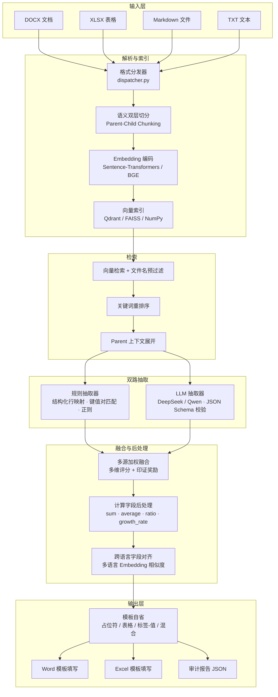
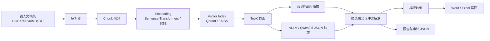

# 基于 RAG 与双路抽取融合的端到端文档理解与模板填表系统

## 摘要

本系统是一个面向非结构化及半结构化政务/统计文档的端到端信息抽取与模板自动填表框架。系统接受 DOCX、XLSX、Markdown、TXT 四种格式的源文档，经过**文档解析 → 语义切分 → 向量检索 → 双路抽取（规则 + LLM）→ 多源融合 → 模板回填**的完整流水线，最终输出已填写的 Word / Excel 模板文件及可追溯的审计报告。

核心设计思路：

1. **检索增强生成（RAG）架构**：通过向量检索将海量文档内容缩减为与目标字段高度相关的证据片段，降低 LLM 的上下文长度与幻觉风险。
2. **双路抽取 + 加权融合**：规则路径提供高置信度、可解释的候选；LLM 路径补充规则无法覆盖的复杂语义场景；融合层通过多维评分与多源印证选择最优值。
3. **模板自省**：自动检测模板的结构模式（占位符、表格、标签-值对、混合），无需用户手动指定填写方式。

---

## 目录

- [1 系统架构](#1-系统架构)
- [2 项目结构](#2-项目结构)
- [3 环境配置](#3-环境配置)
- [4 核心流程详解](#4-核心流程详解)
  - [4.1 文档解析](#41-文档解析)
  - [4.2 文档切分（Chunking）](#42-文档切分chunking)
  - [4.3 向量索引与检索](#43-向量索引与检索)
  - [4.4 信息抽取](#44-信息抽取)
  - [4.5 多源融合](#45-多源融合)
  - [4.6 模板填写](#46-模板填写)
- [5 使用方式](#5-使用方式)
  - [5.1 CLI 模式](#51-cli-模式)
  - [5.2 HTTP 服务模式](#52-http-服务模式)
- [6 配置说明](#6-配置说明)
- [7 字段规格（FieldSpec）](#7-字段规格fieldspec)
- [8 输出说明](#8-输出说明)
- [9 示例](#9-示例)

---

## 1 系统架构



流水线编排由 `Pipeline` 类（`app/pipeline.py`）统一调度，各阶段组件可独立替换。

---

## 2 项目结构

```
program1/
├── main.py                        # CLI 入口（ingest / query / fill / serve）
├── config/
│   ├── config.yaml                # 全局配置（LLM、Embedding、检索、日志等）
│   └── field_specs.example.yaml   # 字段规格示例
├── app/
│   ├── pipeline.py                # 核心流水线编排
│   ├── schemas.py                 # 数据结构定义（Chunk, FieldSpec, FusionDecision 等）
│   ├── settings.py                # 配置加载器（支持点分隔路径访问）
│   ├── field_specs.py             # 字段规格加载与推断
│   ├── fusion.py                  # 多候选融合与冲突解决
│   ├── llm_client.py              # OpenAI 兼容 Chat API 客户端
│   ├── cache.py                   # MD5 键值文件缓存
│   ├── city_utils.py              # 城市名提取、标准化与约束过滤
│   ├── io_utils.py                # 多编码回退文件读取
│   ├── exceptions.py              # 自定义异常体系
│   ├── logging_config.py          # 日志配置
│   ├── parser/                    # 文档解析层
│   │   ├── dispatcher.py          #   格式分发器
│   │   ├── docx_parser.py         #   Word 文档解析
│   │   ├── xlsx_parser.py         #   Excel 表格解析
│   │   ├── md_parser.py           #   Markdown 解析
│   │   └── txt_parser.py          #   纯文本解析
│   ├── chunker/                   # 文档切分层
│   │   └── simple_chunker.py      #   双层语义切分（Parent-Child）
│   ├── retriever/                 # 检索层
│   │   ├── embedding.py           #   Embedding 模型（ST / BGE / 词袋回退）
│   │   ├── vector_index.py        #   向量索引（Qdrant / FAISS / NumPy）
│   │   ├── simple_retriever.py    #   检索器（向量 + 关键词混合重排）
│   │   └── document_store.py      #   文档加载辅助
│   ├── extractor/                 # 抽取层
│   │   ├── simple_extractor.py    #   规则抽取器（结构化映射 + 正则 + NER）
│   │   ├── llm_extractor.py       #   LLM 抽取器（动态分批 + 重试 + Schema 校验）
│   │   ├── bulletin_extractor.py  #   统计公报专用直接抽取器
│   │   ├── prompt_templates.py    #   Prompt 构建器
│   │   └── json_utils.py          #   LLM 输出 JSON 解析
│   ├── filler/                    # 模板填写层
│   │   ├── smart_filler.py        #   智能分发器（按模板格式选择填写策略）
│   │   ├── excel_filler.py        #   Excel 填写（占位符 + 标签 + 表格）
│   │   ├── word_filler.py         #   Word 填写（占位符 + 表格 + 标签式表格）
│   │   └── utils.py               #   模板自省与布局分析
│   └── api/
│       └── server.py              # FastAPI HTTP 服务
├── sentencetransformers/          # 本地 Embedding 模型权重
├── data/                          # 示例数据文档
├── example/                       # 端到端示例（数据 + 模板 + 用户要求）
├── outputs/                       # 默认输出目录
├── cache/                         # 向量索引缓存
└── requirements.txt               # Python 依赖
```

---

## 3 环境配置

### 3.1 依赖安装

```bash
pip install -r requirements.txt
```

主要依赖：

| 依赖 | 用途 |
|---|---|
| `sentence-transformers` | 多语言文本向量化 |
| `qdrant-client` | 向量数据库（本地模式） |
| `python-docx` / `docxtpl` | Word 文档读写 |
| `openpyxl` | Excel 文件读写 |
| `requests` | LLM API 调用 |
| `jsonschema` | LLM 输出结构校验 |
| `rapidfuzz` | 模糊字符串匹配 |
| `fastapi` / `uvicorn` | HTTP 服务 |
| `pyyaml` | 配置文件解析 |

### 3.2 LLM 配置

本系统通过 OpenAI 兼容 API 调用大语言模型。在 `config/config.yaml` 中配置 LLM 端点，并设置环境变量：

```bash
export DEEPSEEK_API_KEY="your-api-key"
```

亦可配置为本地部署的 vLLM / Ollama 等兼容接口（参见 `docs/wsl_vllm_qwen25_3b.md`）。

### 3.3 Embedding 模型

默认使用本地 `paraphrase-multilingual-MiniLM-L12-v2` 模型（已包含在 `sentencetransformers/` 目录中），支持中英跨语言语义匹配。亦可在配置中切换为 BGE-M3 等其他模型。

---

## 4 核心流程详解

### 4.1 文档解析

格式分发器（`dispatcher.py`）根据文件后缀自动选择对应解析器，统一输出 `ParsedDocument` 结构。

| 格式 | 解析器 | 特性 |
|---|---|---|
| `.docx` | `docx_parser` | 按 XML 子节点顺序遍历，保持段落与表格原始顺序；维护 Heading 层级面包屑；支持多级合并表头检测（最多 4 行，以 `" > "` 拼接层级）；通过 `id(cell._tc)` 去重处理合并单元格 |
| `.xlsx` | `xlsx_parser` | 三层容错策略（`data_only=True` → `data_only=False` → XML 直接解析）；每行生成带 `structured_row`（`{header: value}` 字典）元数据的 Chunk；日期/时间列自动格式化 |
| `.md` | `md_parser` | 按双换行分割段落块；识别 Markdown 表格语法（`\| col \| col \|`），表格行生成带 `structured_row` 的 Chunk |
| `.txt` | `txt_parser` | 按行切分；同时识别 Markdown 竖线表格与制表符分隔表格（TSV）|

### 4.2 文档切分（Chunking）

系统采用 **Parent-Child 双层语义切分**策略：

- **Parent Chunk**：按文档自然结构分组（同一表格、同一 Heading 章节），保留完整上下文，供 LLM 抽取时使用。
- **Child Chunk**：在 Parent 内部通过**句子感知贪婪合并**进一步切分为较短片段，用于向量检索以获得更高的定位精度。
- 句子切分按中文句末标点（`。！？`）→ 分号（`；`）→ 逗号（`，`）进行分层拆分。

此设计兼顾检索精度（小粒度 Child）与 LLM 上下文完整性（大粒度 Parent）。

### 4.3 向量索引与检索

#### Embedding 编码

| 后端 | 说明 |
|---|---|
| `SentenceTransformerBackend` | 基于 `sentence-transformers` 库，默认方案 |
| `BGEBackend` | 基于 `FlagEmbedding`，支持 BAAI/BGE-M3 / Dense 两种模式 |
| 词袋回退 | 依赖缺失时自动降级为 512 维词袋向量 |

自动检测计算设备（CUDA → MPS → CPU）。

#### 向量索引

系统提供三种可切换的向量索引后端：

| 后端 | 实现 | 适用场景 |
|---|---|---|
| `QdrantVectorIndex` | Qdrant 向量数据库（本地模式） | 默认方案，支持持久化与 Payload 过滤 |
| `FaissVectorIndex` | Facebook FAISS（`IndexFlatIP`） | 大规模文档高性能检索 |
| `NumpyVectorIndex` | 纯 NumPy 内积 | 零依赖轻量方案 |

#### 检索流程

1. 对查询文本进行 Embedding 编码
2. **文件名预过滤**：计算查询向量与各文档文件名向量的相似度，过滤不相关文档来源的 Chunk
3. 向量近邻检索获取 Top-K Child Chunk
4. **关键词重排序**：按 `0.8 × 向量分 + 0.2 × 关键词分` 混合排序
5. **Parent 上下文展开**：将命中的 Child Chunk 替换为其所属 Parent Chunk，并去重

### 4.4 信息抽取

系统采用**规则优先、LLM 兜底**的双路抽取策略。

#### 4.4.1 规则抽取器

不依赖外部模型，支持以下抽取模式（按置信度降序排列）：

| 模式 | 置信度 | 说明 |
|---|---|---|
| 结构化行映射 | ~0.98 | 从 `structured_row` 字典中按字段名 / 别名精确匹配 |
| 键值对匹配 | ~0.93 | 匹配文本中的 `"字段名：值"` 模式 |
| 自定义正则 | ~0.88 | 按 `FieldSpec.regex_patterns` 定义的正则表达式匹配 |
| 轻量 NER | ~0.74 | 基于实体类型的模式匹配（日期、金额、人名等） |

此外，规则抽取器负责从用户查询中解析约束条件（目标地点、日期范围、数量限制等），供后续检索和抽取阶段使用。

#### 4.4.2 LLM 抽取器

当规则候选不足时，调用 OpenAI 兼容 API（DeepSeek / Qwen / vLLM 等）进行补充抽取：

- **动态分批**：按 `field_batch_size` 对字段分批，每批独立构建 Prompt，避免超出模型上下文上限；当单批超限时对半拆分递归处理。
- **共享证据池**：多字段的检索命中结果合并去重，每条证据标注其关联的字段列表（`relevant_for`），消除重复 token 的同时保持跨字段语义关联。
- **结构化输出与校验**：要求 LLM 输出严格 JSON 格式，通过 `jsonschema` 逐字段校验。校验失败时自动将错误信息追加到 Prompt 末尾并重试（最多 `max_retries` 次）。
- **抽取规则硬约束**：Prompt 中嵌入 9 条规则，包括：禁止编造缺失值、纯数值不带单位、多级表头需选择最细粒度层级、允许推算合计值等。

#### 4.4.3 统计公报专用抽取器

针对含 `【xxx】` 中文占位符的统计公报类模板，不经过向量检索，直接在源文本中定位：

- **段落对齐法**：以占位符前后的模板文字为锚点，在源文本中精确定位对应数值
- **结构模式法**：处理"占比 %""增长 %""每千人口"等复合数值结构
- **字段名搜索法**：以字段名及其变体在锚定区域搜索匹配

### 4.5 多源融合

融合层负责从规则路径和 LLM 路径产出的多个候选值中选出最终结果。

#### 字段级融合

1. 对每个候选值进行 `jsonschema` 格式校验，过滤不合规候选
2. **多源印证奖励**：相同值被不同来源（规则 / LLM / 不同 Chunk）独立产出时，每多一个来源加 0.04 分（上限 0.10），鼓励多路互证
3. 按 `final_score() + corroboration_bonus` 排序，取最优
4. 生成可解释的 `FusionDecision`（包含所有候选、评分明细、决策理由）

其中 `final_score()` 为**五维加权评分**：来源置信度、文本相似度、位置相关度、格式匹配度、约束满足度。

#### 记录级融合

1. **兼容性分组**：非空字段重叠且值一致的候选归入同一组，互补字段自动合并（高分优先）
2. 组内取最优，组间按 `证据得分 + 字段完整度 + 印证奖励` 排序
3. 支持 `max_records` 截断

#### 计算字段后处理

对标记了 `computation` 属性的字段，若融合阶段未直接获得值，则触发后计算：

| 计算类型 | 执行方式 |
|---|---|
| `sum` / `average` / `count` | Python 精确计算 |
| `ratio` / `growth_rate` | 构建专用 Prompt 交由 LLM 完成 |

#### 跨语言字段对齐

利用多语言 Embedding 模型计算源数据列头（如英文 `"GDP"`）与目标字段名（如中文 `"国内生产总值"`）的余弦相似度。超过阈值的列头自动追加到 `FieldSpec.aliases`，使后续结构化行映射和 LLM Prompt 均能正确识别跨语言字段。

### 4.6 模板填写

#### 模板自省

系统自动分析模板结构，返回 `TemplateLayout`，包含：

- 检测到的占位符类型（`{{xxx}}`、`【xxx】`、`____`、`[ ]`、`（）`）
- 表格布局信息（表头行、数据起始行、目标城市、可用容量）
- 标签-值对位置
- 填写模式自动判断（纯占位符 / 纯表格 / 混合模式）

#### Excel 模板填写

1. `{{field_name}}` / `【xxx】` 占位符替换
2. 标签-值对填写（字段名单元格右侧写入值）
3. 表格数据批量填写（按表头列模糊映射，支持追加多行记录）
4. 空白占位符（`____` / `[ ]` / `（）`）自动替换

#### Word 模板填写

1. `{{xxx}}` 占位符替换（含 4 级模糊匹配策略：精确 → 归一化 → 上下文关键词 → 包含匹配）
2. `【xxx】` 中文占位符替换
3. 表格内占位符与标签-值对处理
4. 标签式表格填写（行标签 × 列头交叉定位单元格）
5. 表格数据填写（自动添加行，使用原始列索引映射避免错位）
6. 单位去重：若模板上下文已含单位，自动从值中剥离以避免重复显示

#### 混合模式

当模板同时包含占位符和表格时，系统分别调用字段抽取与记录抽取，并支持用表格记录的汇总值反哺占位符空值。

---

## 5 使用方式

### 5.1 CLI 模式

系统提供四个子命令：

#### 文档注入（仅解析与建索引）

```bash
python main.py ingest --dir <数据目录>
```

#### 字段查询抽取（返回 JSON 结果）

```bash
python main.py query \
  --dir <数据目录> \
  --query "提取合同金额和负责人" \
  --field-specs config/field_specs.example.yaml
```

#### 模板填表（端到端执行）

```bash
python main.py fill \
  --dir <数据目录> \
  --template <模板文件路径> \
  --query "智能填表，将文件内容填入模板中" \
  --output <输出文件路径>
```

亦可通过 `--query-file` 指定需求文件：

```bash
python main.py fill \
  --dir example/2025山东省环境空气质量监测数据信息 \
  --template example/2025山东省环境空气质量监测数据信息/2025山东省环境空气质量监测数据信息-模板.docx \
  --query-file example/2025山东省环境空气质量监测数据信息/用户要求.txt
```

### 5.2 HTTP 服务模式

启动 FastAPI 服务后，支持两阶段交互式工作流：先上传数据文档解析一次，再逐个上传模板获取已填文件。

#### 启动服务

```bash
python main.py serve --host 0.0.0.0 --port 8000
```

启动后访问 `http://localhost:8000/docs` 可查看 Swagger 交互式 API 文档。

#### API 端点

| 端点 | 方法 | 功能 |
|---|---|---|
| `/ingest` | `POST` | 上传数据文档（支持多文件），解析并建立向量索引 |
| `/fill` | `POST` | 上传一个模板文件 + 需求文本，返回已填写的文件（直接下载） |
| `/status` | `GET` | 查看当前状态（是否已解析、文档数量、Chunk 数量） |
| `/reset` | `POST` | 清空已解析数据与缓存，重新开始 |

#### 调用示例

```bash
# 第一步：上传数据文档（仅需执行一次）
curl -X POST http://localhost:8000/ingest \
  -F "files=@data/Excel/糖尿病患者数据.xlsx" \
  -F "files=@data/word/2021年民政事业发展统计公报.docx"

# 第二步：上传模板，获取已填文件（可反复调用）
curl -X POST http://localhost:8000/fill \
  -F "template=@模板4_糖尿病患者数据.xlsx" \
  -F "query=请根据已解析的数据智能填写模板" \
  -o outputs/模板4_已填.xlsx

# 继续上传下一个模板（数据无需重新上传）
curl -X POST http://localhost:8000/fill \
  -F "template=@模板5_2025国考职位表.docx" \
  -F "query=请根据已解析的数据智能填写模板" \
  -o outputs/模板5_已填.docx
```

---

## 6 配置说明

全局配置文件位于 `config/config.yaml`，各模块参数说明如下：

```yaml
llm:
  provider: deepseek              # LLM 服务提供商
  url: https://api.deepseek.com/v1/chat/completions  # API 端点
  model: deepseek-reasoner        # 模型名称
  api_key_env: DEEPSEEK_API_KEY   # API Key 对应的环境变量名
  timeout_seconds: 90             # 单次请求超时时间（秒）
  max_retries: 3                  # JSON 校验失败后的最大重试次数
  temperature: 0.1                # 生成温度（越低越确定性）
  max_context_tokens: 30000       # Prompt 上下文长度上限（token）
  field_batch_size: 2             # 单次 LLM 调用的字段分批大小

embedding:
  backend: sentence_transformers  # 向量化后端（sentence_transformers / bge）
  model: sentencetransformers     # 模型路径或 HuggingFace 名称
  device: auto                    # 计算设备（auto / cuda / cpu）

retrieval:
  backend: qdrant                 # 向量索引后端（qdrant / faiss / numpy）
  top_k: 5                        # 字段级检索返回数量
  record_top_k: 20                # 记录级检索返回数量
  use_parent_context: true        # 是否启用 Parent-Child 分层检索
  child_chunk_size: 300           # Child Chunk 目标字符数
  chunk_size: 600                 # Parent Chunk 目标字符数

logging:
  level: INFO                     # 日志级别

cache:
  dir: cache/qdrant               # 向量索引持久化目录

output:
  dir: outputs                    # 默认输出目录
```

---

## 7 字段规格（FieldSpec）

`FieldSpec` 定义了系统对单个目标字段的完整抽取策略。支持通过 YAML / JSON 文件显式配置，也支持从模板中检测到的字段名自动推断。

完整属性示例：

```yaml
fields:
  - name: 合同金额                    # 字段名称（必填）
    description: 合同中的总金额        # 字段描述（用于构建检索查询和 LLM Prompt）
    aliases: [总金额, 价税合计]        # 别名列表（用于结构化行映射和模糊匹配）
    value_type: currency              # 值类型（currency / person / datetime / numeric / text）
    required: true                    # 是否必填
    regex_patterns:                   # 自定义正则表达式（命名分组 value 为提取目标）
      - "(?:合同金额|总金额)\\s*[：:]\\s*(?P<value>[\\d,.]+\\s*(?:元|万元|亿元)?)"
    keyword_hints: [金额, 价税]       # 关键词提示（用于检索阶段的关键词重排序）
    entity_hints: [currency]          # 实体类型提示（用于轻量 NER 匹配）
    prompt_hint: 优先提取带单位的金额   # LLM Prompt 中的额外抽取指导
    examples: ["100000.00元"]         # 示例值（用于 LLM Prompt 参考）
    computation: sum                  # 计算类型（sum / average / count / ratio / growth_rate）
    source_fields: [子项金额1, 子项金额2]  # 计算所依赖的源字段
    schema:                           # JSON Schema（用于 LLM 输出格式校验）
      type: ["string", "null"]
```

若未提供 `FieldSpec` 配置文件，系统将根据模板中检测到的字段名调用 `infer_value_type()` 自动推断值类型及相关属性。

---

## 8 输出说明

系统对每次填表任务产出两个文件：

1. **已填模板文件**：与输入模板同格式（`.xlsx` 或 `.docx`），默认保存至 `outputs/` 目录，命名为 `{原模板名}_已填.{ext}`。

2. **审计报告**（`report.json`）：与已填模板同目录的 JSON 文件，包含完整的决策追溯信息：
   - 检索命中的 Chunk 列表及其相似度分数
   - 各字段的全部候选值、来源标识、多维评分明细
   - 融合决策的最终选择及自然语言决策理由
   - 填写结果汇总统计

该审计报告使系统决策过程完全可追溯，便于人工审查和质量评估。

---

## 9 示例

`example/` 目录下提供三个端到端示例，每个包含数据文档、模板文件和用户要求文件：

| 示例 | 数据格式 | 模板格式 | 场景特点 |
|---|---|---|---|
| `2025山东省环境空气质量监测数据信息/` | XLSX | DOCX | 大规模结构化表格的记录抽取、城市约束过滤 |
| `2025年中国城市经济百强全景报告/` | DOCX | XLSX | 非结构化长文档的字段抽取、跨语言列头对齐 |
| `COVID-19数据集/` | XLSX + DOCX | XLSX | 多源异构文档融合、跨文档记录互补 |

运行示例：

```bash
python main.py fill \
  --dir example/COVID-19数据集 \
  --template "example/COVID-19数据集/COVID-19 模板.xlsx" \
  --query-file example/COVID-19数据集/用户要求.txt
```
# 文档理解与模板填表系统

一个面向 `DOCX/XLSX/MD/TXT` 的端到端 Python 系统，覆盖：

- 文档解析与 Chunk 化
- `Sentence-Transformers/BGE` 向量化
- `FAISS/Qdrant` 检索
- 规则/轻量 NER + `vLLM(Qwen2.5)` JSON 抽取
- 多候选融合与可解释决策
- Word/Excel 模板自动填表

## 1. 架构



## 2. 关键文件

- `main.py`: CLI 入口
- `app/pipeline.py`: 主流程编排
- `app/schemas.py`: `FieldSpec`、Chunk、FusionDecision 等数据结构
- `app/field_specs.py`: 字段配置加载
- `app/parser/`: 文档解析
- `app/retriever/`: Embedding 与向量检索
- `app/extractor/`: 规则/NER/LLM 抽取与 JSON 校验
- `app/fusion.py`: 多候选融合
- `app/filler/`: Word/Excel 模板写回
- `config/field_specs.example.yaml`: 示例字段配置

## 3. FieldSpec 示例

```yaml
fields:
  - name: 合同金额
    aliases: [总金额, 价税合计]
    value_type: currency
    regex_patterns:
      - "(?:合同金额|总金额)\\s*[：:]\\s*(?P<value>(?:人民币|¥|￥)?\\s*\\d[\\d,]*(?:\\.\\d+)?\\s*(?:元|万元|亿元)?)"
    prompt_hint: 优先提取带单位的金额
    schema:
      type: ["string", "null"]
```

## 4. 抽取策略

### 4.1 规则/NER 优先

优先从结构化表格行、`字段名: 值` 键值对、自定义正则、轻量实体模式中抽取高置信候选。

### 4.2 vLLM 兜底

当规则候选不足时，调用 OpenAI 兼容的 vLLM 接口：

```bash
python main.py run ^
  --dir example\\2025山东省环境空气质量监测数据信息 ^
  --template example\\2025山东省环境空气质量监测数据信息\\2025山东省环境空气质量监测数据信息-模板.docx ^
  --query-file example\\2025山东省环境空气质量监测数据信息\\用户要求.txt
```

## 5. Prompt 示例

字段抽取 Prompt 的核心形式：

```text
你是一个严格的信息抽取助手。请只依据给定证据输出 JSON，不要补充解释，不要编造缺失值。

用户要求:
提取负责人、合同金额

字段定义:
[
  {
    "name": "负责人",
    "aliases": ["项目负责人", "联系人"]
  },
  {
    "name": "合同金额",
    "aliases": ["总金额", "价税合计"]
  }
]

候选证据:
[
  {
    "chunk_id": "doc1:chunk:5",
    "text": "项目负责人：张三"
  }
]
```

记录抽取 Prompt 的核心形式：

```text
你是一个严格的结构化表格抽取助手。请从候选证据中抽取可以直接写入模板表格的记录。

用户要求:
提取 2025-11-25 09:00:00 德州市的空气质量监测记录

字段定义:
["城市", "区", "站点名称", "空气质量指数", "PM10监测值"]
```

## 6. 重试与校验

- 先解析模型输出 JSON
- 再用 `jsonschema` 校验结构
- 校验失败时自动补充“校验错误”并重试
- 重试次数由 `config/config.yaml -> llm.max_retries` 控制

## 7. 输出

系统输出：

- 填好数据的模板文件
- 同名 `report.json`

报告中包含：

- 检索结果
- 候选值
- 融合决策说明
- 最终填表结果
