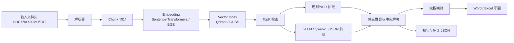

# 文档理解与模板填表系统

一个面向 `DOCX/XLSX/MD/TXT` 的端到端 Python 系统，覆盖：

- 文档解析与 Chunk 化
- `Sentence-Transformers/BGE` 向量化
- `FAISS/Qdrant` 检索
- 规则/轻量 NER + `vLLM(Qwen2.5)` JSON 抽取
- 多候选融合与可解释决策
- Word/Excel 模板自动填表

## 1. 架构



## 2. 关键文件

- `main.py`: CLI 入口
- `app/pipeline.py`: 主流程编排
- `app/schemas.py`: `FieldSpec`、Chunk、FusionDecision 等数据结构
- `app/field_specs.py`: 字段配置加载
- `app/parser/`: 文档解析
- `app/retriever/`: Embedding 与向量检索
- `app/extractor/`: 规则/NER/LLM 抽取与 JSON 校验
- `app/fusion.py`: 多候选融合
- `app/filler/`: Word/Excel 模板写回
- `config/field_specs.example.yaml`: 示例字段配置

## 3. FieldSpec 示例

```yaml
fields:
  - name: 合同金额
    aliases: [总金额, 价税合计]
    value_type: currency
    regex_patterns:
      - "(?:合同金额|总金额)\\s*[：:]\\s*(?P<value>(?:人民币|¥|￥)?\\s*\\d[\\d,]*(?:\\.\\d+)?\\s*(?:元|万元|亿元)?)"
    prompt_hint: 优先提取带单位的金额
    schema:
      type: ["string", "null"]
```

## 4. 抽取策略

### 4.1 规则/NER 优先

优先从结构化表格行、`字段名: 值` 键值对、自定义正则、轻量实体模式中抽取高置信候选。

### 4.2 vLLM 兜底

当规则候选不足时，调用 OpenAI 兼容的 vLLM 接口：

```bash
python main.py run ^
  --dir example\\2025山东省环境空气质量监测数据信息 ^
  --template example\\2025山东省环境空气质量监测数据信息\\2025山东省环境空气质量监测数据信息-模板.docx ^
  --query-file example\\2025山东省环境空气质量监测数据信息\\用户要求.txt
```

## 5. Prompt 示例

字段抽取 Prompt 的核心形式：

```text
你是一个严格的信息抽取助手。请只依据给定证据输出 JSON，不要补充解释，不要编造缺失值。

用户要求:
提取负责人、合同金额

字段定义:
[
  {
    "name": "负责人",
    "aliases": ["项目负责人", "联系人"]
  },
  {
    "name": "合同金额",
    "aliases": ["总金额", "价税合计"]
  }
]

候选证据:
[
  {
    "chunk_id": "doc1:chunk:5",
    "text": "项目负责人：张三"
  }
]
```

记录抽取 Prompt 的核心形式：

```text
你是一个严格的结构化表格抽取助手。请从候选证据中抽取可以直接写入模板表格的记录。

用户要求:
提取 2025-11-25 09:00:00 德州市的空气质量监测记录

字段定义:
["城市", "区", "站点名称", "空气质量指数", "PM10监测值"]
```

## 6. 重试与校验

- 先解析模型输出 JSON
- 再用 `jsonschema` 校验结构
- 校验失败时自动补充“校验错误”并重试
- 重试次数由 `config/config.yaml -> llm.max_retries` 控制

## 7. 输出

系统输出：

- 填好数据的模板文件
- 同名 `report.json`

报告中包含：

- 检索结果
- 候选值
- 融合决策说明
- 最终填表结果
